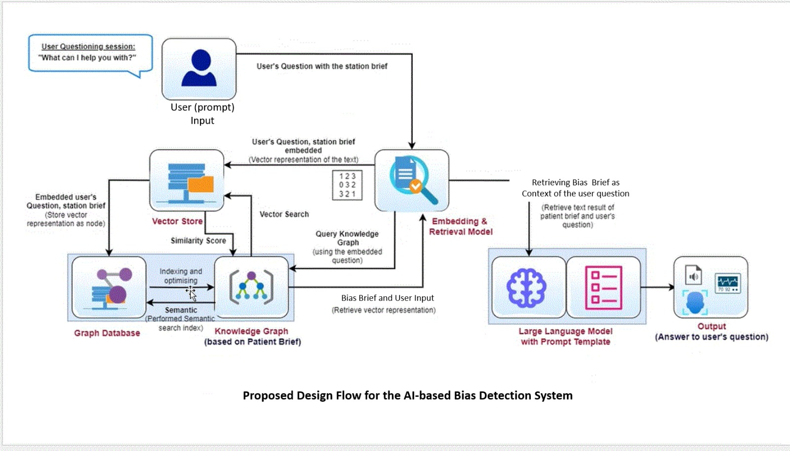
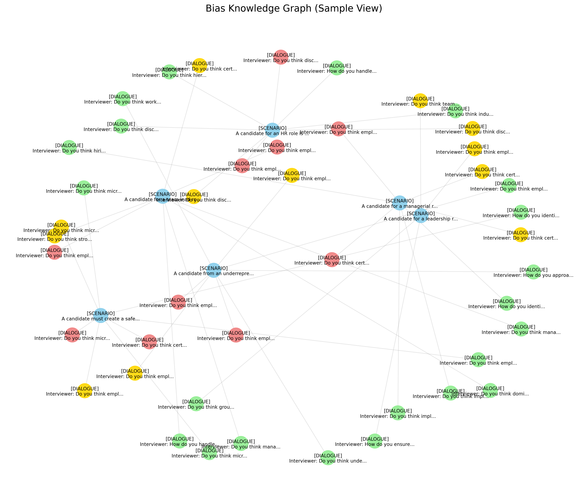

# AI-Based Bias Detection & Ethical Analysis System

A complete Retrieval-Augmented Generation (RAG) pipeline that detects, classifies and explains social bias in natural-language text.  The project combines large-scale curated datasets, transformer models, a similarity-based **vector store**, a graph-structured **knowledge base**, and a Flask web interface to deliver end-to-end bias analysis.

> **Flowchart** See `static/bias_design_flow.jpg` for the high-level execution flow referenced throughout this document.  Each numbered step in the diagram is mapped to concrete code in the *Implementation Checklist* section.

---

## Table of Contents
1.  [Quick Start](#quick-start)
2.  [Architecture Overview](#architecture-overview)
3.  [Model Architecture & Rationale](#model-architecture--rationale)
4.  [Repository Layout](#repository-layout)
5.  [Datasets](#datasets)
6.  [Pre-processing & Knowledge-Asset Building](#pre-processing--knowledge-asset-building)
7.  [Training Pipeline](#training-pipeline)
8.  [Vector Store & Knowledge Graph](#vector-store--knowledge-graph)
9.  [Bias-Analysis RAG Pipeline](#bias-analysis-rag-pipeline)
10. [Web Application](#web-application)
11. [API Endpoints](#api-endpoints)
12. [Evaluation Utilities](#evaluation-utilities)
13. [Configuration](#configuration)
14. [Implementation Checklist ⇄ Flowchart](#implementation-checklist-flowchart)
15. [Sample Questions](#sample-questions)
16. [Troubleshooting & FAQs](#troubleshooting--faqs)
17. [Extending the System](#extending-the-system)

---

## Quick Start
```bash
# 1.  (Recommended) create a virtual environment
$ python -m venv .venv
$ source .venv/Scripts/activate        # Windows
# source .venv/bin/activate            # macOS / Linux

# 2.  Install project requirements
$ pip install -r requirements.txt

# 3.  Download the generative LLM (≈ 8 GB) – can be run overnight
$ python download_model.py             # requires a valid HF token in config.ini

# 4.  Build knowledge assets (vector store + graph visual)
$ python preprocess_data.py            # prompts before rebuilding if cache exists

# 5.  Fire-up the web server
$ python app.py                        # visit  http://localhost:5001
```

> **Note** GPU acceleration is detected automatically (`config.USE_CUDA`).  CPU-only execution is possible but slower.

---

## Architecture Overview


The flowchart above depicts the end-to-end data path:

1. **User Prompt** – A user submits a free-text question via the web UI.
2. **Embedding & Vector Store** – The text is embedded with Sentence-Transformers and compared against scenario vectors in `bias_vector_store.pkl`.
3. **Knowledge Graph** – Connected dialogues and bias metadata are fetched, forming a context bundle ("Bias Brief").
4. **Prompt Assembly** – The brief plus user question are assembled into Gemma 3 chat messages.
5. **Large Language Model** – The Gemma 3 instruction-tuned LLM generates a context-grounded, bias-aware answer.
6. **Output Rendering** – The UI visualises the answer, bias gauge, and relevant graph snapshot.

Each block is colour-coded and numbered identically to the *Implementation Checklist* for 1-to-1 traceability.

---

## Model Architecture & Rationale

### 1. Sentence-Transformers — `all-mpnet-base-v2` (Retrieval Encoder)
- **Role**  Encodes every scenario and user query into a 768-D dense vector for semantic search.
- **Architecture**  Encoder-only Transformer (MPNet) wrapped by Sentence-Transformers bi-encoder fine-tuning.
- **Why chosen**  SOTA semantic performance at manageable size; CPU-friendly; multilingual coverage.
- **Code locations**  `vector_store.py → BiasVectorStore.__init__`, `.load_data()`, `.search()`.

### 2. Knowledge-Graph (NetworkX)
- Although not an ML model, the undirected graph built in `vector_store.py` provides structural explainability.
- **Nodes**: scenarios & dialogues  **Edges**: `has_example` (bias level), `similar_to` (cosine sim).
- Visualised via `BiasVectorStore.visualize_graph()` → `static/knowledge_graph.png`.

### 3. Gemma 3 (google/gemma-3-1b-it) – Generative LLM
- **Role**  Generates the final, context-grounded answer.
- **Model card**  [Gemma 3 1B IT on Hugging Face](https://huggingface.co/google/gemma-3-1b-it)
- **Why chosen**  Lightweight, multimodal-capable family with strong instruction-following; supports chat templates via Transformers ≥ 4.50.0.
- **Code locations**  `models.py → BiasAnalysisPipeline.__init__` (model load) & `.analyze()` (generation).
- **Generation params**  `max_new_tokens≈300`, `temperature=0.7`, `top_p=0.95`, beam search 5, with chat template via `tokenizer.apply_chat_template`.

### 4. DistilBERT (Optional Bias-Score Regressor)
- **Role**  Predicts a scalar bias intensity (0-1) for dialogue snippets.
- **Architecture**  6-layer encoder with regression head.
- **Training**  `python train.py`; metrics MSE/MAE/R²; checkpoint saved to `models/bias_classifier/`.
- Not loaded by default in the web app but can augment `/analyze` responses.

### 5. End-to-End Model Flow
1. **Embed** user question with Sentence-Transformers.
2. **Retrieve** top-k scenarios via cosine similarity.
3. **Assemble** chat messages (`config.PROMPT_TEMPLATE` → `apply_chat_template`).
4. **Generate** answer with Gemma 3 (1B IT).
5. *(Optional)* **Score** bias with DistilBERT.

> GPU acceleration is auto-detected (`config.USE_CUDA`). All models fall back to CPU when CUDA is unavailable.

---

## Repository Layout
```
├── app.py                     # Flask entry-point
├── models.py                  # Retrieval-Augmented Generation (RAG) pipeline
├── vector_store.py            # Embedding, similarity search & graph utilities
├── preprocess_data.py         # Builds vector store & graph visual
├── train.py                   # Optional bias-regression model training script
├── download_model.py          # Offline download helper for the LLM
├── dataset/                   # 10 JSON files (≈4 MB) with multi-level bias examples
├── static/                    # Images: graph visual & bias gauge
├── templates/                 # Jinja2 HTML templates (UI)
├── evaluation_results/        # Stored evaluation metrics & figures
├── requirements.txt           # Python dependencies
└── config.py / config.ini     # Centralised settings
```

*(files inside `.venv/` are intentionally ignored)*

---

## Datasets
• **Source** Synthetic + curated real-world examples grouped into **11 bias categories** (Personal Identity, Social, Professional & Educational, …, Misc).
• **Granularity** Each scenario contains 6 dialogue versions labelled *No Bias (0 %) → Extreme (100 %)*.
• **Statistics**
  – >30 k dialogues   – 11 bias types   – 6 scalar bias levels

> Run `python preprocess_data.py --analyze-stats` (function `analyze_dataset_stats`) for a live summary.

---

## Pre-processing & Knowledge-Asset Building
Script `preprocess_data.py`
1. Parses every JSON file in `dataset/`.
2. Encodes scenario & dialogue texts with **Sentence-Transformers** (`all-mpnet-base-v2`).
3. Stores embeddings + metadata in a Python `pickle` (`bias_vector_store.pkl`).
4. Builds an **undirected graph** (`networkx`):
   • Nodes: scenarios & dialogues • Edges: *has_example*, *similar_to*
5. Saves a PNG visual (`static/knowledge_graph.png`).

Re-running the script will detect an existing cache and ask whether to rebuild.

---

## Training Pipeline
Script `train.py` *(optional – pre-trained DistilBERT works out-of-the-box)*
1. Loads text/label pairs (`load_bias_data`).
2. Splits 80 / 20 into train/val (`scikit-learn`).
3. Fine-tunes a **DistilBERT** regression head on scalar bias (0–1).
4. Logs MSE, MAE, R², stores best model in `models/bias_classifier/`.

Hyper-parameters are centralised in `config.py` – tweak epochs, batch-size, LR, etc.

---

## Vector Store & Knowledge Graph
Module `vector_store.py`
• **Embedding** Sentence-Transformers via `SentenceTransformer` API.
• **Similarity** Cosine, threshold = 0.65 for inter-scenario edges.
• **API**
  – `search(query, top_k)`          → returns similar scenarios
  – `query_knowledge_graph(query)`   → sub-graph with neighbours
  – `get_bias_examples(query, level)` → dialogue examples @ desired bias level
• **Visualisation** `visualize_graph()` generates the PNG used in UI.



---

## Bias-Analysis RAG Pipeline
Module `models.py`
1. **Retrieval** Calls `vector_store.search()` with the user question.
2. **Prompt Construction** Builds Gemma 3 chat messages using `config.PROMPT_TEMPLATE`.
3. **Generation** Feeds chat-formatted inputs to **Gemma 3 (1B IT)** via `AutoModelForCausalLM.generate`.
4. **Return Structure**
```json
{
  "answer":          "LLM-generated neutral explanation…",
  "source_contexts": ["…"],
  "bias_type":       "social_bias"
}
```

A singleton (`get_analysis_pipeline`) caches the model & store to avoid reload overhead.

---

## Web Application
Entry `app.py` (Flask)
• `/` Main UI (`templates/index.html`) – text box, *Analyze Bias* button, gauge & graph image.
• `/analyze` (POST) JSON API powering the button; delegates to `analysis_pipeline.analyze()`.
• `/evaluation` Manual QA page running predefined questions.
• Static resources (graph, gauges) served via `/static/<file>`.

Run on `0.0.0.0:5001` – change port in `app.py` if required.

---

## API Endpoints
| Method | Route | Payload / Params | Description |
|-------:|-------|------------------|-------------|
| `GET`  | `/` | – | Serves the main HTML interface |
| `POST` | `/analyze` | `{ "question": "..." }` | Core RAG endpoint – returns JSON with `answer`, `source_contexts`, `bias_type` |
| `GET`  | `/evaluation` | – | Displays manual evaluation page |
| `POST` | `/run_evaluation` | – | Batch-runs RAG answers for the preset questions in `config.py` |
| `GET`  | `/static/<path>` | – | Serves static assets (graph, gauge, CSS) |

All responses are UTF-8 encoded JSON except for static/HTML routes.

---

## Evaluation Utilities
* `templates/metrics.html`, `evaluation_results/metrics.json`
* Confusion matrix (`confusion_matrix.png`) for the optional classifier.
* `/run_evaluation` endpoint automates RAG-based responses over `config.EVALUATION_QUESTIONS`.

---

## Configuration
Settings live in **two** files:
1. `config.py` – technical knobs (paths, models, hyper-params).
2. `config.ini` – *private* secrets (Hugging-Face token).  **Add your token** under
```
[huggingface]
token = hf_XXXXXXXXXXXXXXXXXXXXXXXX
```

---

## Implementation Checklist ⇄ Flowchart
| # | Flowchart Step | Implementing File(s)/Function(s) | Status |
|---|----------------|----------------------------------|:------:|
| 0 | Build vector store & graph (offline) | `preprocess_data.py`, `vector_store.py` | ✓ |
| 1 | User enters question in web UI | `templates/index.html`, `<form id="analyze-form">` | ✓ |
| 2 | Flask receives request | `app.py → /analyze` | ✓ |
| 3 | Retrieve similar scenarios | `vector_store.BiasVectorStore.search()` | ✓ |
| 4 | Assemble prompt with context | `models.BiasAnalysisPipeline.analyze()` | ✓ |
| 5 | Generate answer with Gemma 3 | `transformers.AutoModelForCausalLM` in `models.py` | ✓ |
| 6 | Return bias type & source contexts | `models.py` (dict return) | ✓ |
| 7 | Render gauge & graph | `templates/index.html`, `static/bias_gauge.png`, `static/knowledge_graph.png` | ✓ |
| 8 | Train optional classifier | `train.py` | ✓ |
| 9 | Evaluate pipeline | `app.py → /run_evaluation`, `evaluation_results/` | ✓ |

All boxes in the provided flowchart have a corresponding checked implementation in the repository.

---

## Sample Questions
Below are a handful of illustrative questions you can copy-paste into the web UI (or `/analyze` API) to see the system in action.

| # | Example Question |
|---|------------------|
| 1 | Why is it problematic to assume someone's capabilities based on their accent? |
| 2 | How can stereotypes about age affect hiring decisions for older candidates? |
| 3 | Describe a scenario where social-class bias might appear in a professional setting. |
| 4 | Explain how confirmation bias can affect a manager's performance review of an employee. |
| 5 | What kind of intersectional bias might a disabled woman from a racial minority face in the workplace? |
| 6 | What challenges can arise when employees with chronic illnesses request flexible working arrangements? |
| 7 | How might assumptions about political beliefs create tension within a diverse project team? |
| 8 | In what ways can parental-status bias affect career progression for single parents? |
| 9 | Why is favouring graduates from elite universities during recruitment considered educational bias? |
| 10 | What problems occur when AI moderation systems learn biased language from social media? |
| 11 | Describe how high-stress situations during crisis management can amplify situational bias in decision-making. |

---

## Troubleshooting & FAQs
**Q 1:** *`ValueError: Hugging Face token not found`*

Add your personal token to `config.ini` under the `[huggingface]` section. Tokens are free: https://huggingface.co/settings/tokens

**Q 2:** *CUDA-out-of-memory during LLM load*

Set `config.USE_CUDA = False` to force CPU inference *or* export `CUDA_VISIBLE_DEVICES=` before running `app.py`.

**Q 3:** *`ModuleNotFoundError: sentence_transformers`*

Run `pip install -r requirements.txt` inside your virtual environment.

**Q 4:** *Vector store takes too long to build*

Execute `python preprocess_data.py --force-rebuild` *overnight* or on a machine with GPU support – subsequent runs simply un-pickle the store.

---

## Advanced: Training Pipeline Documentation

### What is the Training Script?

The `train.py` script trains a **supplemental bias classifier** - an additional ML model that can predict bias intensity levels in text. This complements the main RAG system by providing quantitative bias scores.

### Purpose & Architecture

- **What it does**: Trains a DistilBERT regression model to predict bias intensity (0-1 scale) from dialogue text
- **Training data**: Uses all bias scenarios from the dataset with their bias level labels
- **Model type**: DistilBERT with regression head (single output neuron for bias score prediction)
- **Integration**: The trained model can be optionally used alongside the main analysis pipeline

### Training Process Walkthrough

#### Step 1: Data Preparation
```python
# Load all conversations from dataset files
texts, labels = load_bias_data()

# Parse bias percentages from version strings:
# - "Version 1: No Bias (0%)" → 0%
# - "Mixed Bias Version 1: Strong Personalities..." → 50% 
# - Extreme bias indicators → 100%
```

#### Step 2: Train/Validation Split
- **80%** training data, **20%** validation data
- Random split with fixed seed for reproducibility

#### Step 3: Model Setup
- **Base model**: `distilbert-base-uncased` (configurable via `config.CLASSIFIER_MODEL`)
- **Architecture**: Classification head repurposed for regression (num_labels=1)
- **Device**: Automatic GPU detection, CPU fallback

#### Step 4: Training Configuration
Default hyperparameters (adjustable in `config.py`):
```python
TRAIN_EPOCHS = 3              # Training iterations
TRAIN_BATCH_SIZE = 8          # Batch size per device
LEARNING_RATE = 5e-5          # Optimizer learning rate
TEST_SPLIT_SIZE = 0.2         # Validation split ratio
```

#### Step 5: Evaluation Metrics
- **MSE (Mean Squared Error)**: Primary metric for regression
- **MAE (Mean Absolute Error)**: Average prediction error
- **R² (Coefficient of Determination)**: Model fit quality

### Running Training

```bash
# Basic training (uses all defaults)
python train.py

# Training will output:
# - Models cached to @.hf_cache/ directory
# - Progress logs with loss/metrics
# - Final evaluation results
# - Saved model in models/bias_classifier/
```

### Output & Results

**Training artifacts:**
- `models/bias_classifier/` - Full model + tokenizer
- `logs/` - TensorBoard logs (if configured)
- `results/` - Checkpoints and final model

**Evaluation metrics example:**
```
Evaluation results:
  eval_loss: 0.0234
  eval_mse: 0.0234
  eval_mae: 0.1254
  eval_r2: 0.8765
```

### Dataset Compatibility

The training script handles multiple bias data formats:
- ✅ **Percentage format**: "Version 1: No Bias (0%)" 
- ✅ **Mixed bias format**: "Mixed Bias Version 1: Strong Personalities..."
- ✅ **Fallback mapping**: Unknown formats → moderate bias (50%)

### Troubleshooting Training Issues

**Q: ValueError: invalid literal for int() with base 10**

This error occurred before our fix. The training script now handles all bias data formats automatically. If you still encounter issues:

1. Check that dataset files contain the expected JSON structure
2. Ensure version strings follow one of the supported formats
3. Use the fallback parsing logic for unsupported formats

**Q: CUDA out of memory during training**

The batch size automatically reduces to 4 for CPU training. Manual override:
```python
TRAIN_BATCH_SIZE = 2  # Further reduce if needed
EVAL_BATCH_SIZE = 2   # Further reduce if needed
```

**Q: Training takes too long**

Try these optimizations:
```python
TRAIN_SAMPLE_RATIO = 0.5  # Use only 50% of data
TRAIN_EPOCHS = 1          # Reduce to 1 epoch
```

**Q: Symlink warnings during training**

These warnings are automatically suppressed in the training script. You can ignore them safely.

**Q: Pin memory warnings**

The training script is configured to disable pin_memory for CPU training, eliminating these warnings.

### Use Cases & Integration

**Current system**: The main analysis uses RAG (retrieval + generation) without requiring this classifier.

**Potential enhancements** (requires integration work):
- Bias score validation alongside analysis
- Confidence metrics for generated responses  
- Bias intensity quantification for scenarios
- Combined RAG + classifier ensemble for bias detection

### Configuration Options

All training parameters are configurable in `config.py`:
```python
# Model Configuration
CLASSIFIER_MODEL = "distilbert-base-uncased"  # Base model to fine-tune

# Training Hyperparameters  
TRAIN_SAMPLE_RATIO = 1.0  # Fraction of data to use (0.0-1.0)
TEST_SPLIT_SIZE = 0.2     # Validation split size
TRAIN_EPOCHS = 3          # Number of training epochs
TRAIN_BATCH_SIZE = 8      # Training batch size
EVAL_BATCH_SIZE = 8       # Evaluation batch size
LEARNING_RATE = 5e-5      # Adam optimizer learning rate
WARMUP_STEPS = 500        # Warmup steps for learning rate scheduler
WEIGHT_DECAY = 0.01       # Weight decay regularization
LOGGING_STEPS = 50        # Steps between logging
```